# Exno:1
Data Cleaning Process

# AIM
To read the given data and perform data cleaning and save the cleaned data to a file.

# Explanation
Data cleaning is the process of preparing data for analysis by removing or modifying data that is incorrect ,incompleted , irrelevant , duplicated or improperly formatted. Data cleaning is not simply about erasing data ,but rather finding a way to maximize datasets accuracy without necessarily deleting the information.

# Algorithm
STEP 1: Read the given Data

STEP 2: Get the information about the data

STEP 3: Remove the null values from the data

STEP 4: Save the Clean data to the file

STEP 5: Remove outliers using IQR

STEP 6: Use zscore of to remove outliers

# Coding and Output
```
import pandas as pd
df=pd.read_csv('/content/Loan_data (1).csv')
df
```
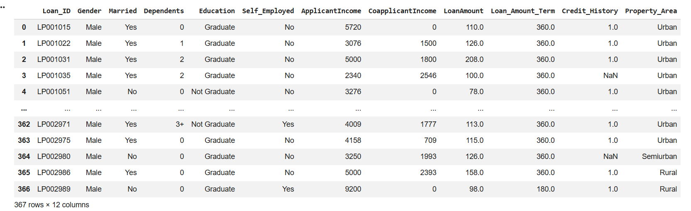
```
df.info()
```
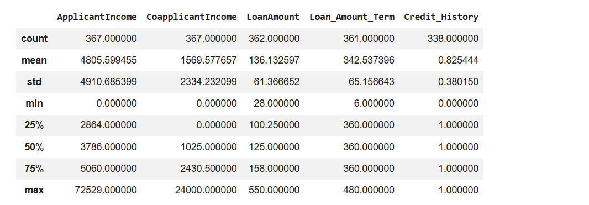

```
df.isnull()
```
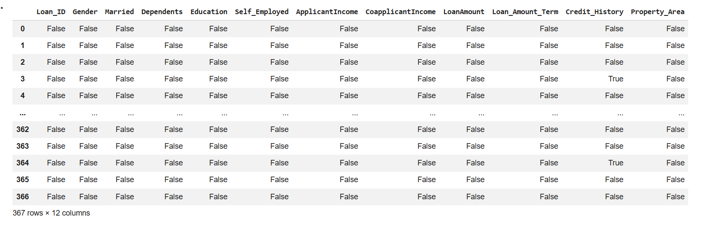

```
df.isnull().sum()
```
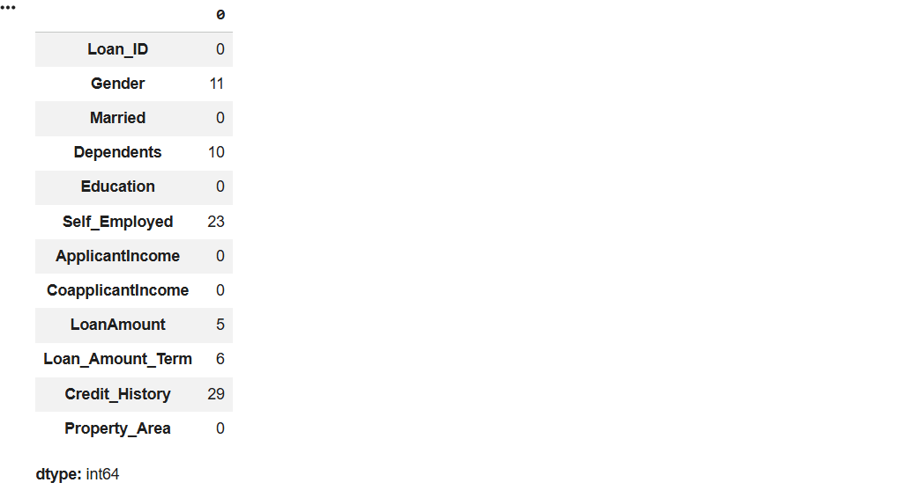

```

df_dropped=df.dropna()
df_dropped
```
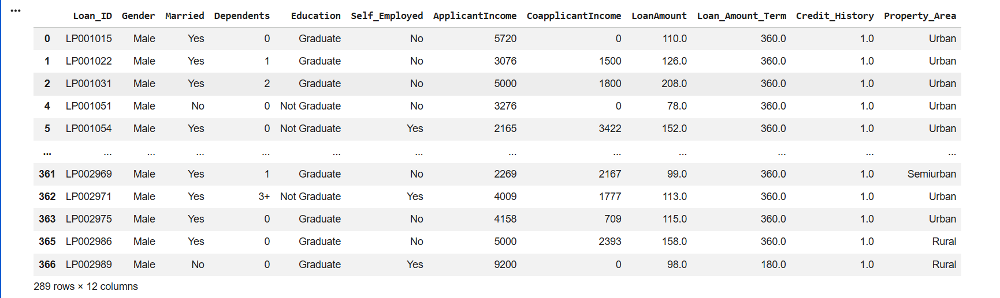

```
df_fill_0=df.fillna(0)
df_fill_0
```
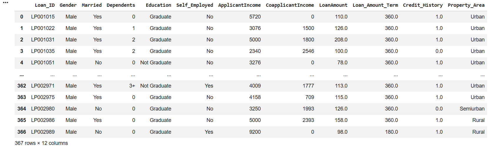
```
df_ffill=df.ffill()
df_ffill
```
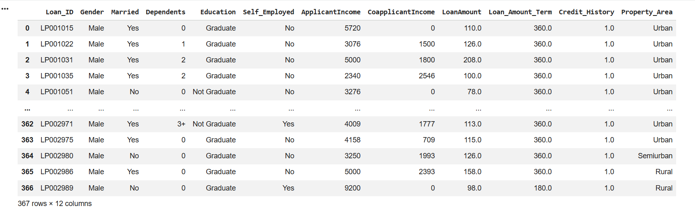
```
df_bfill=df.bfill()
df_bfill
```
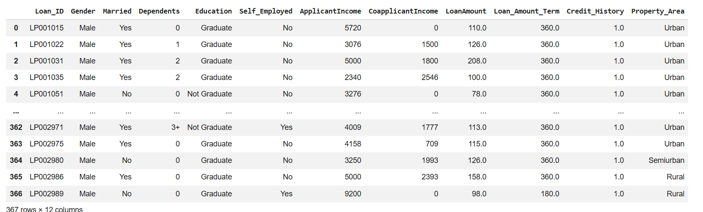
```
df_new=df
df_new['LoanAmount']=df['LoanAmount'].fillna((df['LoanAmount']).mean)
df_new['Loan_Amount_Term']=df['Loan_Amount_Term'].fillna((df['Loan_Amount_Term']).mean)
df_new
```
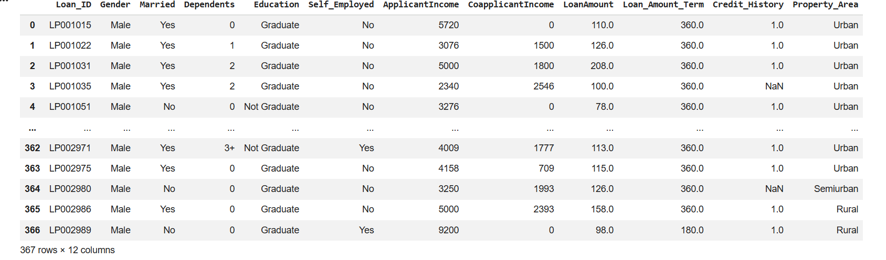
```
df_new.dropna(axis=0)
```
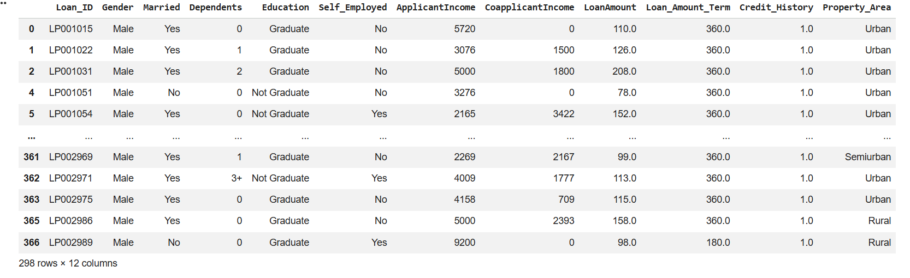
```
import pandas as pd
import seaborn as sns
age=[1,3,28,27,25,92,30,39,40,50,26,24,29,94]
af=pd.DataFrame(age)
af
```
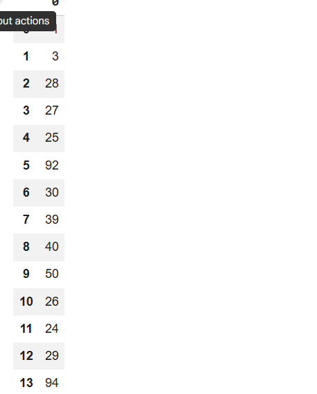

```
sns.boxplot(data=af)
```
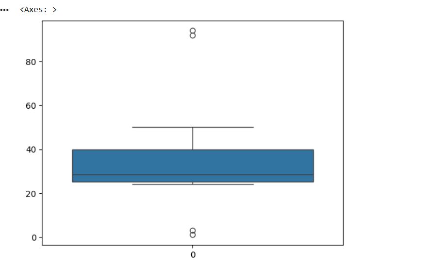
```
import numpy as np

# Quartiles
Q1 = np.percentile(age, 25)
Q2 = np.percentile(age, 50)
Q3 = np.percentile(age, 75)

# IQR Method
IQR = Q3 - Q1
lower_bound = Q1 - 1.5 * IQR
upper_bound = Q3 + 1.5 * IQR

# Detect Outliers (keeps NaN values like the screenshot)
outliers = af[(af < lower_bound) | (af > upper_bound)]

# Print Output
print("Quantile 1", Q1)
print("Quantile 2", Q2)
print("Quantile 3", Q3)
print("Inter Quartile Range", IQR)
print("Lower Bound", lower_bound)
print("Upper Bound", upper_bound)
print("Outliers")
print(outliers)
```
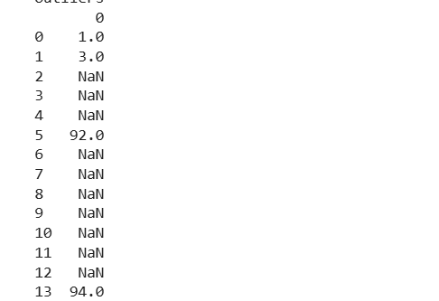
```
af=af[(af>=lower_bound) & (af<=upper_bound)]
af.dropna()
print("After removing outliers")
af
```
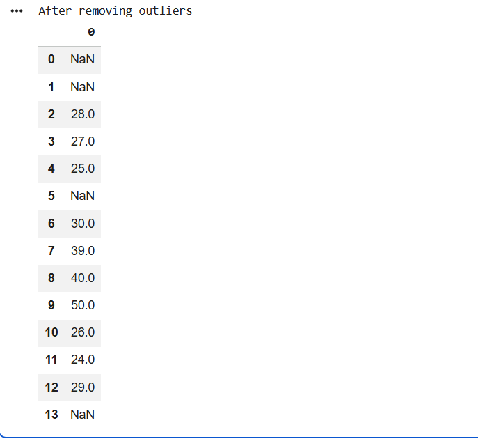

# Result
          <<include your Result here>>
